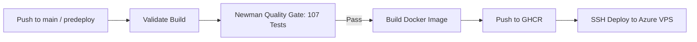

# 🏛️ Rosetta — Unified Collaboration Hub (CSE-JU)

[](https://github.com/MDTHA-X/rosetta-for-all/actions)
[](http://40.83.100.54)
[](https://nodejs.org)
[](https://www.docker.com)

> **Rosetta** is a unified collaboration and communication platform featuring full REST API endpoints, real-time messaging, kanban board task workflows, channel indexing, user connection networks, and automated CI/CD deployment to Azure VPS.

---

## 🌐 Live Deployment
- **Production URL:** [http://40.83.100.54/](http://40.83.100.54/)
- **API Health Check:** [http://40.83.100.54/api/health](http://40.83.100.54/api/health)
- **API System Stats:** [http://40.83.100.54/api/stats](http://40.83.100.54/api/stats)

---

## 🚀 Key Features & Modules

1. **🔐 Authentication & User Profile Management**
   - JWT-based auth with token verification & Bearer header support.
   - User registration (`POST /api/auth/register`), login (`POST /api/auth/login`), profile updates (`PATCH /api/auth/me`), password updates (`PATCH /api/auth/me/password`), and user search.

2. **🤝 Known Network & Connection Requests**
   - Send connection requests (`POST /api/connections/request`).
   - Accept or decline incoming requests (`PATCH /api/connections/:id`).
   - Query accepted, incoming, and outgoing connections (`GET /api/connections`).

3. **💬 Channels & Unread Tracking**
   - Manage text channels (`GET`, `POST`, `PATCH`, `DELETE /api/channels`).
   - Track unread indicators per user (`GET /api/channels/unread`, `POST /api/channels/:id/read`).

4. **📨 Real-Time Message Streams**
   - Fetch channel messages with pagination & `before` timestamps (`GET /api/messages?channelId=...`).
   - Post messages (`POST /api/messages`), edit messages (`PATCH /api/messages/:id`), delete messages (`DELETE /api/messages/:id`) with strict user-ownership enforcement (403 on unauthorized modifications).

5. **📋 Kanban Sprint Board & Task Cards**
   - Dynamic board columns & WIP limits (`GET`, `PATCH /api/board/config`).
   - Full card lifecycle (`GET`, `POST`, `PATCH`, `DELETE /api/cards`) with priority enums (`urgent`, `high`, `medium`, `low`), column assignment, and keyword search.

---

## 🧪 Automated Testing (107 Tests Passing)

The test suite is divided into two sequential quality gates executed via Newman CLI:

| Suite | Scope | Tests | Status |
| :--- | :--- | :---: | :---: |
| **Chunk 1** | Auth, Users, Connections, Channels | 57 | ✅ **57 / 57 Passed** |
| **Chunk 2** | Messages, Board Config, Cards | 50 | ✅ **50 / 50 Passed** |
| **Total** | **Full End-to-End Test Suite** | **107** | ✅ **100% Green** |

### Run Tests Locally
```bash
# Start server in background
node server.js &

# Run Chunk 1 (57 tests)
npx newman run Rosetta_API_Tests_Chunk1_of_2.postman_collection.json --env-var baseUrl=http://localhost:3000/api --env-var token=test-token

# Run Chunk 2 (50 tests)
npx newman run Rosetta_API_Tests_Chunk2_of_2.postman_collection.json --env-var baseUrl=http://localhost:3000/api --env-var token=test-token
```

---

## 🔄 CI/CD Pipeline Architecture



- **Workflow File:** [`.github/workflows/deploy.yml`](.github/workflows/deploy.yml)
- **Quality Gate:** Fails the build immediately if any of the 107 test cases fail.
- **Auto-Deploy:** On successful merge to `main`, pushes to GitHub Container Registry and restarts the container on Azure VM `40.83.100.54`.

---

## 💻 Local Development Setup

### Prerequisites
- Node.js >= 20.x
- npm >= 10.x

### Installation & Run
```bash
# Clone the repository
git clone https://github.com/MDTHA-X/rosetta-for-all.git
cd rosetta-for-all

# Install dependencies
npm install

# Start development server
node server.js
```
The server will boot at `http://localhost:3000`.

---

## 🐳 Docker Setup

```bash
# Build Docker image
docker build -t rosetta-hub .

# Run container
docker run -d -p 80:3000 --name rosetta-app rosetta-hub
```

---

## 📄 License
CSE-JU Web Development II Project. All rights reserved.
