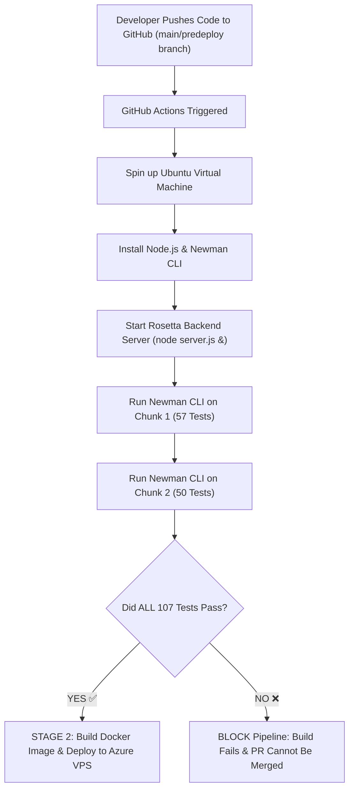

# Comprehensive Guide: Rosetta API Test Cases, HTTP Methods, & GitHub CI/CD Automated Testing

---

## Table of Contents
1. [HTTP Request Methods Explained (What is `PATCH`?)](#1-http-request-methods-explained-what-is-patch)
2. [Rosetta API Test Collection — Detailed Breakdown of Chunk 1](#2-rosetta-api-test-collection--detailed-breakdown-of-chunk-1)
   - [Module 1: System Endpoints (TC001 – TC004)](#module-1-system-endpoints-tc001--tc004)
   - [Module 2: Auth & Users Endpoints (TC005 – TC033)](#module-2-auth--users-endpoints-tc005--tc033)
   - [Module 3: Connections Endpoints (TC034 – TC044)](#module-3-connections-endpoints-tc034--tc044)
   - [Module 4: Channels Endpoints (TC045 – TC057)](#module-4-channels-endpoints-tc045--tc057)
3. [How Test Cases Run Automatically in GitHub (CI/CD Quality Gate)](#3-how-test-cases-run-automatically-in-github-cicd-quality-gate)
   - [What is CI/CD & GitHub Actions?](#what-is-cicd--github-actions)
   - [Step-by-Step GitHub Actions Workflow Breakdown (`deploy.yml`)](#step-by-step-github-actions-workflow-breakdown-deployyml)
   - [What is Newman?](#what-is-newman)
   - [The Quality Gate & Deployment Rule](#the-quality-gate--deployment-rule)

---

## 1. HTTP Request Methods Explained (What is `PATCH`?)

When an application (like a Web App, Mobile App, or Postman) talks to a backend server API, it sends an **HTTP Request**. The request includes an **HTTP Method** (also called an HTTP Verb) that specifies what action the server should perform.

### Summary Comparison Table

| HTTP Method | Primary Action | Real-World Analogy | Modifies Existing Data? |
| :--- | :--- | :--- | :--- |
| **`GET`** | **Fetch / Read** data | Reading a book or viewing a user profile | ❌ No (Read-only) |
| **`POST`** | **Create** new data | Submitting a new user sign-up form | 🆕 Creates new entry |
| **`PUT`** | **Replace** an entire item | Overwriting an entire record with a new file | 🔄 Full replacement |
| **`PATCH`** | **Partially Update** specific fields | Updating *only* your phone number on your profile | ✏️ Partial modification |
| **`DELETE`** | **Remove** data | Deleting an account or message | 🗑️ Removes item |

---

### Detailed Look at `PATCH` (vs `PUT`)

Many beginners get confused between **`PUT`** and **`PATCH`**:

#### 1. `PATCH` (Partial Update)
`PATCH` is used when you want to update **only specific attributes** of a resource without touching the rest of the object.

* **Example Request (`PATCH /users/me`):**
  ```json
  {
    "status": "away"
  }
  ```
* **Effect:** The server updates *only* the `status` property to `"away"`. The user's name, email, password hash, and avatar remain completely unchanged.

#### 2. `PUT` (Full Replacement)
`PUT` expects you to send the **entire object**. If you omit fields in a `PUT` request, those missing fields might be overwritten with `null` or erased.

* **Example Analogy:**
  - **`PUT`**: Replacing your entire student record file with a brand new paper.
  - **`PATCH`**: Taking an eraser and updating only your address line on the existing paper.

---

## 2. Rosetta API Test Collection — Detailed Breakdown of Chunk 1

The file `Rosetta_API_Tests_Chunk1_of_2.postman_collection.json` is a **Postman Test Collection** containing **57 automated API test cases**. These tests verify that the Rosetta backend API functions correctly, handles errors properly, and enforces authentication security.

```
Chunk 1 (57 Automated Test Cases)
├── 1. System Module (TC001 - TC004)
├── 2. Auth & Users Module (TC005 - TC033)
├── 3. Connections Module (TC034 - TC044)
└── 4. Channels Module (TC045 - TC057)
```

---

### Module 1: System Endpoints (TC001 – TC004)
Verifies basic server health, uptime metrics, and global stats.

* **`TC001 - GET /health`**: Tests if the server returns HTTP Status `200 OK` and a `status` property.
* **`TC002 - GET /health`**: Verifies that the response body includes operational telemetry: `uptime`, `memoryUsage`, and `timestamp`.
* **`TC003 - GET /stats`**: Tests if the `/stats` endpoint returns HTTP Status `200 OK`.
* **`TC004 - GET /stats`**: Ensures system counters (`totalUsers`, `totalMessages`, `totalCards`, `totalChannels`) are valid numeric types.

---

### Module 2: Auth & Users Endpoints (TC005 – TC033)
Validates registration, authentication security, password updates, user profiles, and directory listing.

#### User Registration (`POST /auth/register`)
* **`TC005` & `TC006`**: Verifies that valid registration returns HTTP `201 Created` and returns a JWT authentication token string.
* **`TC007`**: **Security Test** — Confirms that the returned user object does **NOT** expose sensitive fields like `password`.
* **`TC008` & `TC009`**: Tests validation rules — returns HTTP `400 Bad Request` if email is missing or formatted incorrectly.
* **`TC010`**: Tests uniqueness constraints — returns HTTP `409 Conflict` if trying to register a duplicate email.

#### User Authentication & Session (`POST /auth/login`, `/logout`, `/refresh`)
* **`TC011` & `TC012`**: Tests successful login returning HTTP `200 OK` and a valid session token.
* **`TC013` & `TC014`**: Tests security boundaries — rejects wrong passwords or unregistered emails with HTTP `401 Unauthorized`.
* **`TC015`**: Rejects missing password payloads with HTTP `400 Bad Request`.
* **`TC016` & `TC017`**: Tests logout functionality — revokes tokens and rejects unauthenticated logout attempts.
* **`TC018` & `TC019`**: Tests JWT token refreshing — generates new tokens for valid sessions while rejecting expired/malformed tokens.

#### Profile & Account Management (`GET` & `PATCH /auth/me`)
* **`TC020` – `TC022`**: Tests fetching current user profile (`/auth/me`), ensuring token authorization is enforced (`401` if token missing).
* **`TC023` & `TC024`**: **`PATCH /auth/me`** — Tests updating profile attributes (e.g. display name) via partial update.
* **`TC025` – `TC027`**: **`PATCH /auth/me/password`** — Tests password changing logic, verifying current password checks and token requirements.

#### User Directory (`GET /auth/users`)
* **`TC028` – `TC030`**: Fetches user list, tests search query parameters, and verifies no user object contains password hashes.
* **`TC031` – `TC033`**: Tests fetching specific user details by ID (`/auth/users/:id`), returning `404 Not Found` for invalid IDs.

---

### Module 3: Connections Endpoints (TC034 – TC044)
Tests peer connections and friend requests between users.

* **`TC034` & `TC035`**: `GET /connections` — Retrieves user connections grouped into `accepted`, `incoming`, and `outgoing` lists. Enforces token requirement (`401`).
* **`TC036` – `TC039`**: `POST /connections/request` — Sends connection requests to target users, handling duplicates (`409 Conflict`) and invalid user IDs (`400 Bad Request`).
* **`TC040` – `TC042`**: **`PATCH /connections/:id`** — Updates connection status to `accepted` or `declined`. Verifies permission checks (`403 Forbidden` if a non-receiving user attempts to accept).
* **`TC043` & `TC044`**: `DELETE /connections/:id` — Removes or cancels a connection.

---

### Module 4: Channels Endpoints (TC045 – TC057)
Tests chat channels, channel settings, membership management, and read/unread counters.

* **`TC045` & `TC046`**: `GET /channels` — Retrieves list of accessible chat channels.
* **`TC047` – `TC049`**: `POST /channels` — Creates new channels (`201 Created`), checking for duplicate names (`409`) or missing names (`400`).
* **`TC050` & `TC051`**: **`PATCH /channels/:id`** — Partially updates channel topic or settings. Returns `404 Not Found` if channel ID doesn't exist.
* **`TC052` & `TC053`**: `DELETE /channels/:id` — Deletes a channel, verifying token authentication.
* **`TC054` – `TC057`**: Tests channel unread state logic (`GET /channels/unread`) and marking messages as read (`POST /channels/:id/read`).

---

## 3. How Test Cases Run Automatically in GitHub (CI/CD Quality Gate)

### What is CI/CD & GitHub Actions?

* **CI (Continuous Integration):** The practice of automatically building and testing code every time a developer commits changes to GitHub.
* **GitHub Actions:** GitHub's built-in cloud automation service. It listens for events (like code `push` or `pull_request`) and spins up virtual machines in the cloud to run scripts.

---

### Step-by-Step GitHub Actions Workflow Breakdown (`.github/workflows/deploy.yml`)

The repository contains a workflow file located at `.github/workflows/deploy.yml`. Here is how it executes tests automatically:



#### Detailed Execution Steps from `deploy.yml`:

1. **Trigger Event:**
   ```yaml
   on:
     push:
       branches: [ "main", "predeploy" ]
     pull_request:
       branches: [ "main" ]
   ```
   Whenever a developer pushes code or submits a Pull Request, GitHub immediately launches the workflow.

2. **Spinning Up Cloud Environment:**
   ```yaml
   runs-on: ubuntu-latest
   ```
   GitHub allocates a fresh, clean Linux container in the cloud.

3. **Installing Dependencies & Newman:**
   ```yaml
   - name: Install Dependencies
     run: |
       npm ci || npm install
       npm install -g newman
   ```
   The workflow installs **Newman**.

#### What is Newman?
> **Newman** is Postman's official command-line runner. It allows you to run Postman collection `.json` files directly inside a terminal or CI server without needing the visual Postman desktop GUI application!

4. **Launching local server inside runner:**
   ```yaml
   - name: Start Rosetta Backend Server
     run: |
       node server.js &
       sleep 3
   ```
   Starts `server.js` in the background inside the temporary virtual machine and waits 3 seconds for it to bind to port `3000`.

5. **Executing Test Cases via Newman:**
   ```yaml
   - name: Run Chunk 1 (57 tests)
     run: |
       newman run Rosetta_API_Tests_Chunk1_of_2.postman_collection.json \
         --env-var baseUrl=http://localhost:3000/api \
         --env-var token=test-token

   - name: Run Chunk 2 (50 tests)
     run: |
       newman run Rosetta_API_Tests_Chunk2_of_2.postman_collection.json \
         --env-var baseUrl=http://localhost:3000/api \
         --env-var token=test-token
   ```

---

### The Quality Gate & Deployment Rule

* **Quality Gate Enforcement:**
  If **even a single test case out of 107 fails** (e.g. if a developer breaks `PATCH /users/me` or `/auth/login`), Newman exits with a failure exit code (`1`).
  GitHub marks the job with a red ❌ and **stops execution immediately**.

* **Deployment Stage (`deploy-production`):**
  ```yaml
  deploy-production:
    needs: [postman-quality-gate]
    if: github.ref == 'refs/heads/main'
  ```
  The production deployment stage has `needs: [postman-quality-gate]`. It will **NEVER** run unless the Postman Quality Gate succeeds 100%.

This automated pipeline guarantees that buggy code is caught in GitHub before it ever reaches real users in production!
